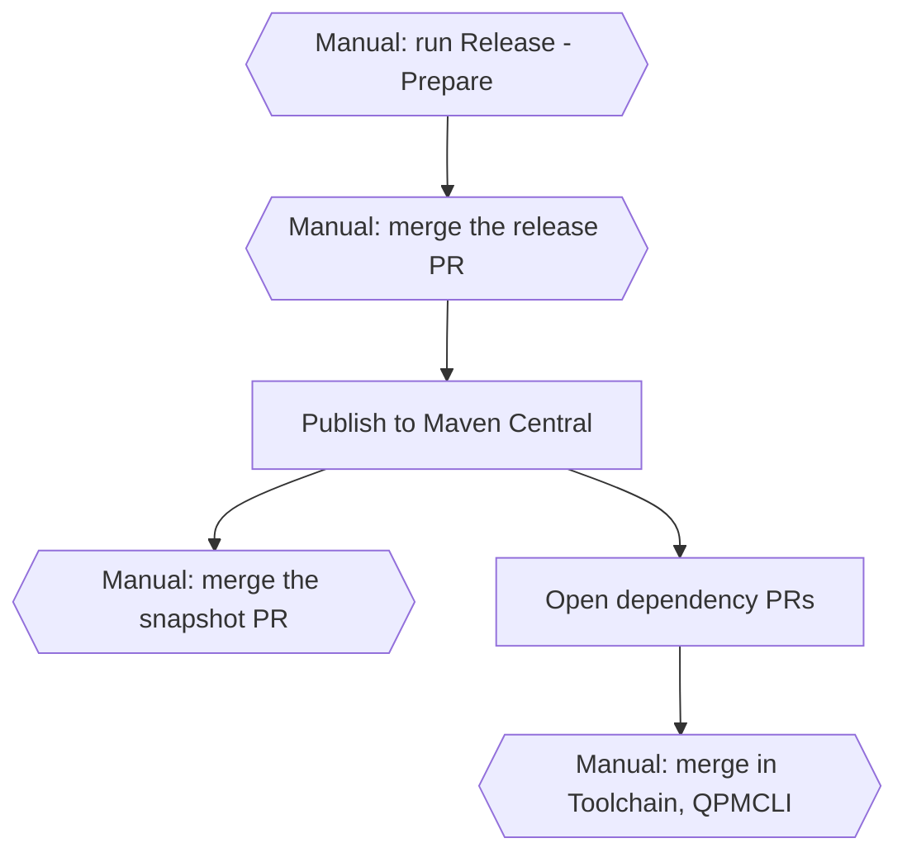

# QilletniPackageUtility Release Protocol

QilletniPackageUtility is a producer repository in the Qilletni release process. The
shared procedure is in the [Qilletni release document][main]. This document gives only the
facts for this repository.

## This repository

| Item | Value |
| --- | --- |
| Component | `qilletni-pkgutil` |
| Kind | `maven` |
| Version | `pkgutilVersion` in `gradle.properties` |
| Publishes to | Maven Central, as `dev.qilletni.pkgutil:qilletni-pkgutil` |
| Release assets | the CycloneDX SBOM, on the GitHub release |
| Snapshots | the Maven Central snapshot repository, for each push to `master` |
| Jobs in `release.yml` | `tag-release`, `publish-snapshot`, `build-and-publish`, `dispatch`, `snapshot-followup` |
| Lockfiles | `gradle.lockfile` |
| Pull request checks | `pr-ci.yml` |
| Consumer repositories | QilletniToolchain, QPMCLI |

## Overview



- A hexagon with "Manual:" is a step that the maintainer does.
- A rectangle is a step that a workflow does.

## Prepare and publish a release

1. Write the changes in the `## [Unreleased]` section of `CHANGELOG.md`. For a major bump,
   also write `docs/migrations/X.Y.Z.md`. **(manual)**
2. Run the `Release - Prepare` workflow. Select the bump. **(manual)**
   Refer to [Prepare a release][prepare].
3. Examine the release PR, then merge it. **(manual)**
4. The `tag-release` job creates the tag. The `build-and-publish` job publishes to Maven
   Central and creates the GitHub release. Refer to [Publish a release][publish].

<details>
    <summary>What if this step fails?</summary>

If `Poll Maven Central for propagation` does not finish, sign in to the
[Central Portal](https://central.sonatype.com/publishing/deployments). Examine the
deployment. If the Portal did not accept the deployment, it shows the reason.

</details>

5. The `snapshot-followup` job opens the snapshot PR. Merge it. **(manual)**
6. The `dispatch` job opens a dependency PR in QilletniToolchain and in QPMCLI. Merge each
   dependency PR. **(manual)** Refer to [Update the consumer repositories][consumers].

### Select the bump

The japicmp gate compares the public API of `qilletni-pkgutil` with the last release.

| Bump | The japicmp gate stops the release if |
| --- | --- |
| `patch` | the public API has a change of any type |
| `minor` | the public API has an incompatible change |
| `major` | the public API has an incompatible change and `docs/migrations/X.Y.Z.md` does not exist |

## Upstream components

This repository consumes no upstream component. It has no `Dependency Update` workflow.

## Dependency locks

`gradle.lockfile` records the exact dependency graph of a release. After a dependency
change, refresh it:

```bash
./gradlew dependencies --write-locks
```

## Links

- [Qilletni release document][main]
- [`release/components.yml`](https://github.com/Qilletni/Qilletni/blob/master/release/components.yml)
- [`tools/release/README.md`](https://github.com/Qilletni/ReleaseTooling/blob/master/README.md)

[main]: https://github.com/Qilletni/Qilletni/blob/master/RELEASE.md
[prepare]: https://github.com/Qilletni/Qilletni/blob/master/RELEASE.md#prepare-a-release
[publish]: https://github.com/Qilletni/Qilletni/blob/master/RELEASE.md#publish-a-release
[consumers]: https://github.com/Qilletni/Qilletni/blob/master/RELEASE.md#update-the-consumer-repositories
